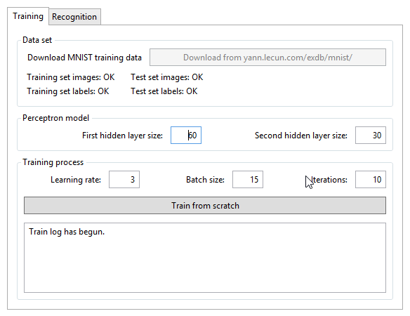
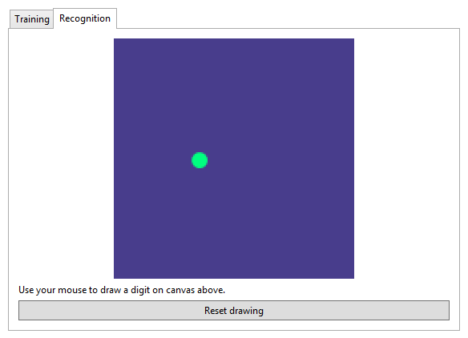

# DigiClass
Very simple digit classification algorithm implementation and demo written purely in C#.
MNIST database of 60k handwritten digits was used for training and 10k testing images were used for evaluation.

Demo program has ink canvas attached so you can draw digits and see how good it's classified.

# Algorithm
Multilayer perceptron algorithm was used for training. Training parameters such as learning rate, batch size and number of epochs are customizable.

# How to use

1. Start with downloading MNIST training data set.

2. Train neural network. It may take several iterations and couple of minutes to complete, but once done, you can reuse it instantly. Neural network model is saved on disk in file `network.xml`. When you restart demo application, it's going to be loaded automatically.

3. Test the neural network model you trained. Use your mouse to draw different digits on canvas and neural network will try to recognize them. 

